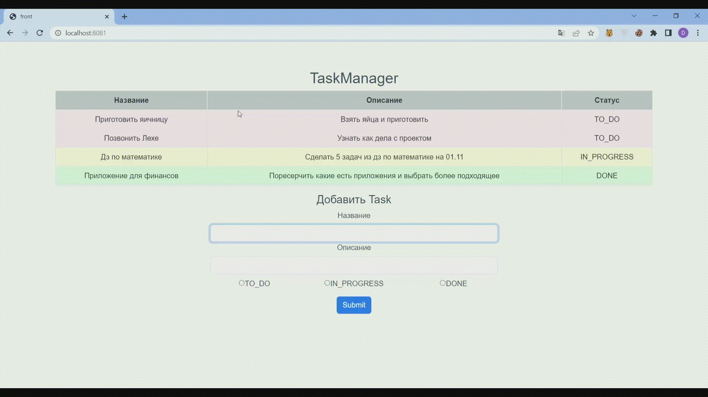
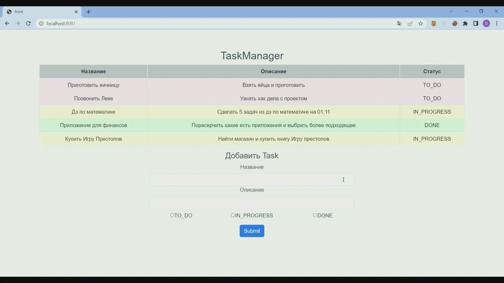
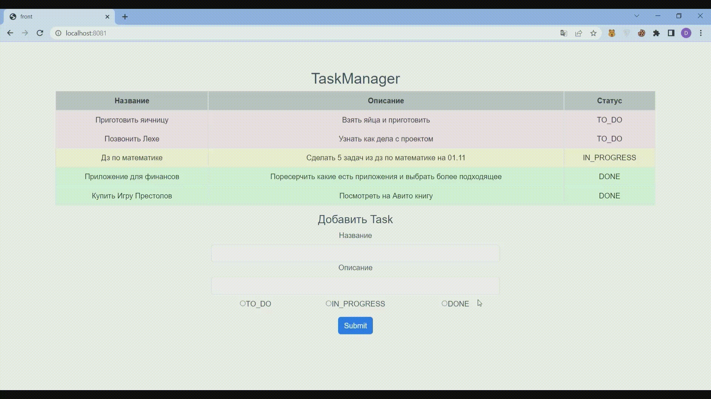
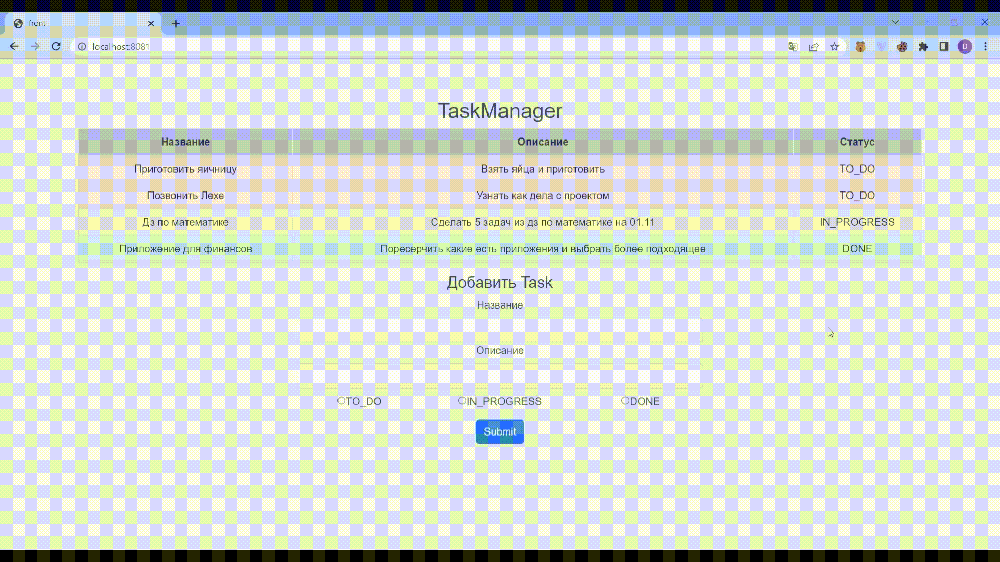

# Simple Task Tracker

## Functional
* Read and view tasks from Backend
* Add task
* Remove task
* Update task
* Sort by name/description/status

### Add task

### Update task

### Delete task

### Sort task
